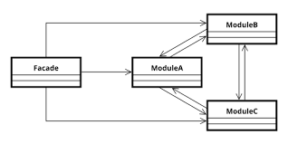

# Patrón Facade

---

## ¿Qué es Facade?

Facade es un **patrón de diseño estructural** que:

- Reduce la complejidad al dividir un sistema en subsistemas.
- Minimiza las comunicaciones y dependencias entre ellos.
- Proporciona una interfaz simple y unificada para interactuar con un sistema complejo.

---

## ¿Cuándo aplicar Facade?

Se utiliza cuando:

- Queremos ofrecer una interfaz sencilla para un subsistema complejo.
- Necesitamos estructurar varios subsistemas en capas.
- Facade actúa como punto de entrada a cada nivel del sistema.

---

## Estructura



---

## Participantes

- **Fachada (Facade):**  
  Conoce qué clases del subsistema son responsables de manejar las peticiones y delega esas solicitudes a los objetos correspondientes del subsistema.

- **Subclases / Subsistemas:**  
  Implementan la funcionalidad del subsistema y realizan el trabajo solicitado por la Fachada. No conocen la existencia de la Fachada.

---

## Colaboraciones

Los clientes se comunican únicamente con la fachada enviando peticiones. La fachada reenvía esas peticiones a los objetos apropiados del subsistema.  
De esta forma, los clientes **no necesitan acceder directamente** a los objetos internos del subsistema.

---

## Ventajas

- **Encapsulamiento:** Los cambios en las clases del subsistema sólo requieren modificaciones en la fachada.
- **Simplicidad:** Los clientes no necesitan conocer las clases que hay detrás de la fachada.
- **Reducción de dependencias:** El cliente sólo depende de la fachada, no del subsistema completo.

---

## Patrones relacionados

- **Singleton:** En algunos casos, las fachadas pueden ser instancias únicas para asegurar que haya una sola fachada que controle el acceso al subsistema.

---

## Ejemplo de problema y solución

### Problema

Imaginá que un usuario quiere reservar un paquete de viaje. Para hacerlo **sin Facade**, tendría que:

- Buscar vuelos en el módulo de aerolíneas.
- Reservar un hotel en el módulo de alojamiento.
- Contratar transporte en el módulo de alquiler de vehículos.
- Pagar en el módulo de pagos.
- Recibir información y confirmaciones desde varios sistemas diferentes.  
  Este proceso es complejo, propenso a errores y difícil de manejar para el usuario o programador.

---

### Solución

Se crea una clase **`AgenciaDeViajesFacade`** que envuelve todos los subsistemas. Ahora el usuario solo debe llamar a un único método, por ejemplo:

```plaintext
reservarPaquete(destino, fecha, cantidadPersonas)
```
